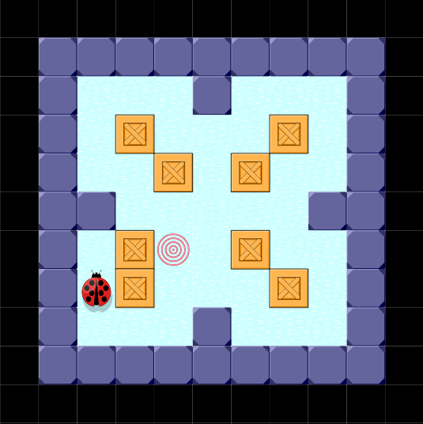
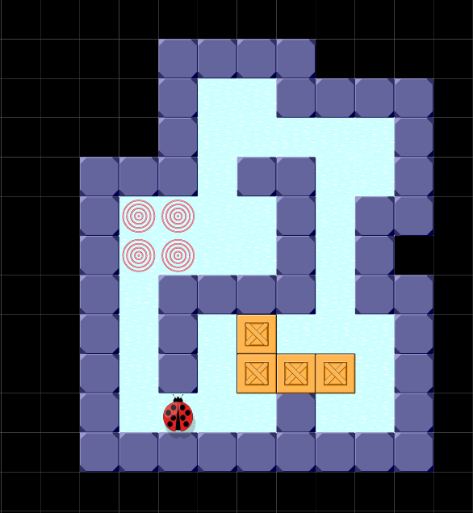

# Sokoban Implementation in Haskell

To be run, requires the `CodeWorld` library.

## Run the game

```
ghc sokoban.hs -threaded
./sokoban
```

## How to play

* `SPACE`   - skip main menu  
* `U`       - undo moves  
* `N`       - next level  
* `W,S,A,D` - movement  

## Example levels:



